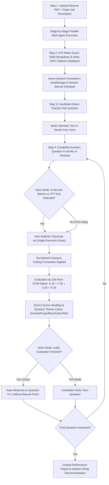
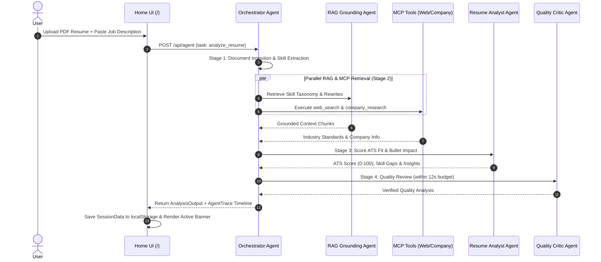
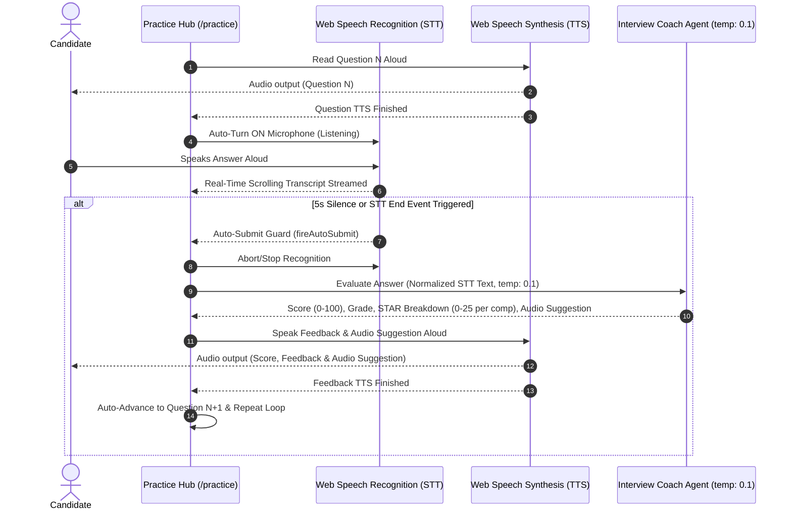

# AI Career Intelligence Platform — Architecture & Complete Workflows

The **AI Career Intelligence Platform** is an end-to-end multi-agent career preparation system. It features **Multi-Agent Supervisor Orchestration**, **Inline RAG Grounding**, **Model Context Protocol (MCP) Tools**, **100-Point STAR Performance Grading**, and a **100% Hands-Free Voice Interview Simulator**.

---

## 🏗️ High-Level System Architecture

```
[ User UI Layer ]
  ├── Home & Upload Hub (/) ────▶ Active Session Resume Banner & ATS Scoring
  ├── Analysis Dashboard (/dashboard) ──▶ ATS Metrics, Skills Match & Nested Knowledge Explorer Tab
  └── Practice Hub (/practice) ──▶ Text / Voice Modes with Single-Question Interview Flow
        │
        ▼
[ Session & State Layer ] (lib/session.ts & providers.tsx)
  └── Persistent localStorage SessionData (resume, JD, ATS results, questions, practice history, traces)
        │
        ▼
[ Multi-Agent Supervisor Layer ] (lib/agents/orchestrator.ts)
  ├── Resume Analyst Agent (llama-3.3-70b-versatile)
  ├── Interview Coach Agent (llama-3.3-70b-versatile) [temperature: 0.1]
  ├── RAG Grounding Agent (llama-3.3-70b-versatile)
  └── Quality Reviewer / Critic Agent (llama-3.1-8b-instant)
        │
    ┌───┴───────────────────────────────┐
    ▼                                   ▼
[ In-Memory RAG Engine ]     [ MCP Interface Layer ]
(lib/rag/)                  (lib/mcp/)
  ├── MemoryVectorStore        ├── Web Search Tool (`web_search`)
  ├── LocalEmbeddings          ├── Company Research Tool (`research_company`)
  └── Domain Knowledge Base    └── GitHub Profile Tool (`get_github_profile`)
        (4 JSON datasets)
```

---

## 🔄 Complete End-to-End User Flow



---

## 📊 Detailed Workflow Sequence Diagrams

### 1. Resume Upload & Parallel Multi-Agent Pipeline



---

### 2. 100% Hands-Free Voice Interview & Deterministic Scoring Flow



---

## 💯 STAR 100-Point Grading System & Score Themes

| Component | Max Points | Evaluation Criteria |
|---|---|---|
| **Situation (S)** | 25 pts | Background context, role clarity, and problem complexity |
| **Task (T)** | 25 pts | Specific challenge definition, goals, and personal responsibility |
| **Action (A)** | 25 pts | Technical depth, personal initiatives, tools used, and steps taken |
| **Result (R)** | 25 pts | Quantified metrics, business impact, and key takeaways |
| **Total Score** | **100 pts** | **Situation + Task + Action + Result** |

### Dynamic Tier Color Themes & Strict Zero-Score Handling
- `90–100`: **Strong Hire (A+)** $\rightarrow$ Emerald Theme (`border-emerald-500`, `bg-emerald-500/10`)
- `80–89`: **Hire (A)** $\rightarrow$ Cyan Theme (`border-cyan-500`, `bg-cyan-500/10`)
- `70–79`: **Leaning Hire (B)** $\rightarrow$ Blue Theme (`border-blue-500`, `bg-blue-500/10`)
- `60–69`: **Needs Work (C)** $\rightarrow$ Amber Theme (`border-amber-500`, `bg-amber-500/10`)
- `< 60`: **No Hire (D)** $\rightarrow$ Red Theme (`border-red-500`, `bg-red-500/10`)

> **Strict 0-Score Preservation**: All score evaluation calculations use nullish coalescing (`??`) rather than logical OR (`||`). Empty, off-topic, or non-answers faithfully display **0/100** and **No Hire (D)** with Red panel styling, eliminating fake default scores.

---

## 🛠️ Technology Stack Overview

| Layer | Technology | Purpose |
|---|---|---|
| **Framework** | Next.js 16 App Router, TypeScript | Core application architecture & API routes |
| **Styling & UI** | Tailwind CSS v4, Shadcn UI, Framer Motion | Theme-aware cards, dark mode, slide-down mobile menu |
| **Theme Management** | `next-themes` | Persistent dark/light mode on `<html>` root |
| **Session Persistence** | `localStorage` + `AppProviders` Context | Unified session across `/`, `/dashboard`, `/practice` |
| **Multi-Agent System** | Groq API (`llama-3.3-70b-versatile` & `llama-3.1-8b-instant`) | Stage progress streaming, `temperature: 0.1` & 8s/12s latency bounding |
| **RAG Engine** | `MemoryVectorStore`, `LocalEmbeddings` (TF-IDF) | Inline `GroundingCitation` badges & Knowledge Explorer |
| **MCP Integration** | `MCPClient` Tool Registry | Parallel execution of web search & company research |
| **Voice Engine** | Web Speech API (STT & TTS) | Hardened `SpeechRecognitionService`, ref-based transcript reading, single-submit guards & live scrolling transcript container |
