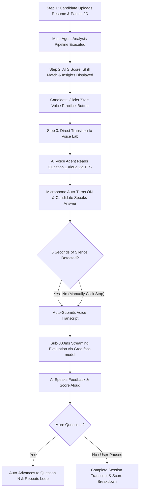
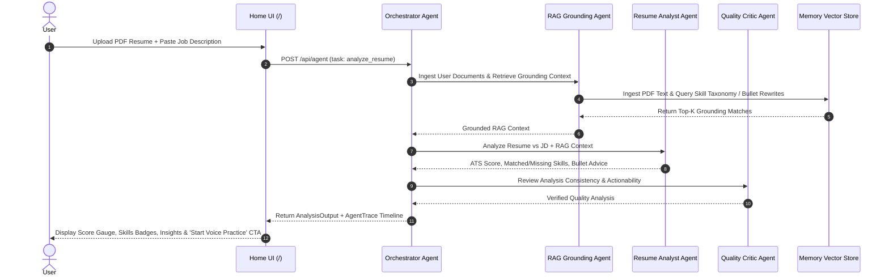
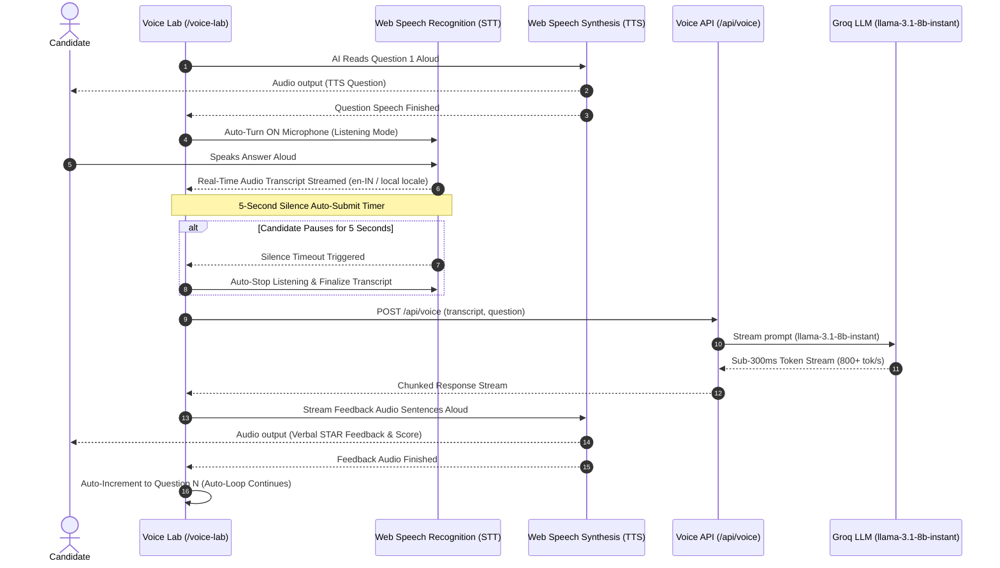

# AI Career Intelligence Platform — Architecture & Complete Workflows

The **AI Career Intelligence Platform** is a multi-agent AI application designed for Faculty Development Program (FDP) demonstrations. It showcases **Multi-Agent Orchestration**, **Retrieval-Augmented Generation (RAG)**, **Model Context Protocol (MCP) Tools**, and an **Ultra-Low Latency Voice Agent**.

---

## 🏗️ High-Level System Architecture

```
[ User UI Layer ]
  ├── Home & Upload Hub (/)
  ├── ATS Analysis Dashboard (/dashboard)
  ├── STAR Interview Preparation (/interview)
  ├── Hands-Free Voice Lab (/voice-lab)
  └── RAG Knowledge Base (/knowledge-base)
        │
        ▼
[ Multi-Agent Supervisor Layer ] (lib/agents/orchestrator.ts)
  ├── Resume Analyst Agent (llama-3.3-70b-versatile)
  ├── Interview Coach Agent (llama-3.3-70b-versatile)
  ├── RAG Grounding Agent (llama-3.3-70b-versatile)
  └── Quality Reviewer / Critic Agent (llama-3.1-8b-instant)
        │
   ┌────┴──────────────────────────────┐
   ▼                                   ▼
[ In-Memory RAG Engine ]     [ MCP Interface Layer ]
(lib/rag/)                  (lib/mcp/)
  ├── MemoryVectorStore        ├── Web Search Tool (`web_search`)
  ├── LocalEmbeddings (TF-IDF) ├── Company Research Tool (`research_company`)
  └── Domain Knowledge Base    └── GitHub Profile Tool (`get_github_profile`)
        (4 JSON datasets)
```

---

## 🔄 Complete End-to-End User Flow



---

## 📊 Detailed Workflow Sequence Diagrams

### 1. Resume Upload & Multi-Agent Analysis Workflow



---

### 2. Hands-Free Interactive Voice Interview Workflow



---

## 🛠️ Technology Stack Overview

| Layer | Technology | Purpose |
|---|---|---|
| **Frontend & Backend** | Next.js 16 App Router, TypeScript | Core application framework & API routes |
| **Styling & UI** | Tailwind CSS v4, Framer Motion, Lucide Icons | Dark mode glassmorphism UI with micro-animations |
| **Agent Orchestration** | LangChain JS / Custom Supervisor Pattern | Agent routing, state management, and trace logging |
| **LLM Inference Engine** | Groq API (`llama-3.3-70b-versatile` & `llama-3.1-8b-instant`) | Ultra-fast token generation (< 200ms latency) |
| **Vector RAG Storage** | `MemoryVectorStore`, `LocalEmbeddings` (TF-IDF) | Self-contained vector database & retrieval |
| **MCP Integration** | Custom `MCPClient` & Tool Registry | Standardized tool execution (`web_search`, `research_company`, `github_profile`) |
| **Voice Processing** | Web Speech Recognition & Web Speech Synthesis API | Zero-dependency browser-native STT and TTS |
